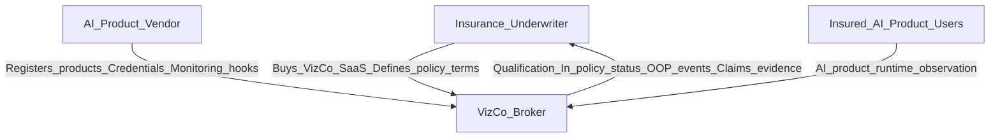

# VizCo platform — phase roadmap

## Working thesis (aligned with CTO vision)

**VizCo is an InsureTech AI information broker.**

It connects:

- **AI vendors** that want to sell *insurable* AI products
- **Insurance underwriters** that need to price, sell, service, and monitor policies on those products
- **Insured end-users** (e.g. a hospital) whose AI product usage must stay in-policy

**We are not a marketplace first.** Marketplace is the future position once VizCo is indispensable as the shared evidence and monitoring layer. Initially, **underwriters buy VizCo SaaS** to monitor policy terms of use and obtain trusted claims evidence — without integrating their backend to every AI vendor.

### The blocker VizCo exists to remove

AI products are not physical assets — they are **decisions** by particular models in particular environments. Underwriters struggle to:

1. Know a vendor/product is **qualified** for a deal
2. Know insured parties **stayed within policy limits** (e.g. 1000 MRI uses)
3. Know the insured used the **covered product version** (v2 not v1)
4. Know whether **other terms** were breached (e.g. IT system failure)
5. Get **trusted environment evidence** when a claim is filed

VizCo answers those with pre-qualification + a **single observation stream** per underwriter across many vendors.

### Commercial framing (for phase prioritization)

| Who | Role early | Role later |
|---|---|---|
| Underwriter | **Paying customer** — monitoring + claims evidence | Still primary buyer; marketplace participant |
| AI vendor | Supplies products, credentials, monitoring integration | Marketplace supplier of pre-connected insurable products |
| Insured end-user | Observed subject (may not need a full portal early) | Possibly self-serve policy/status views |
| VizCo | Broker of qualification, usage evidence, claims context | Indispensable marketplace / info brokerage |

### Product surfaces

- **Vendor portal** — register insurable products, qualify, connect monitoring
- **Underwriter portal** — see qualified products, policies, live use, OOP events, claims evidence
- **Insured-user surface** — deferred until monitoring is real; model the entity earlier if needed

---

## Principles for every phase

- Climb the CTO ladder in order: **qualify → bind terms → observe use → claims evidence → marketplace**
- Two distinct portals from day one (Vendor vs Underwriter)
- One vertical slice per phase; complete and document before detailing the next
- Prefer **versioned AI products** as the atomic unit (not vague “deployments” only)
- Design observation around **monitorable policy terms**, not generic telemetry dump
- Stay a modular monolith until observation volume forces a split
- Complete **one phase at a time**

---

## Phase 0 — Foundation (platform shell)

**Goal:** Authenticated dual-portal shell ready for broker features.

**Deliverables:**

- Auth / session
- Roles: `vendor`, `underwriter` (data model may include `insured_org` as an entity without a portal yet)
- Routes: `/vendor/*`, `/underwriter/*`
- Postgres: orgs, users, role membership
- Empty intentional home states per role
- Cloud Agent / local run path remains working

**Out of scope:** Questionnaires, policies, monitoring, claims

**Exit criteria:** Vendor and underwriter users sign in and only see their portal.

**CTO question unlocked:** none yet — plumbing only.

---

## Phase 1 — Pre-qualify vendors and versioned AI products

**Goal:** Answer *“How did the underwriter know ACME could be qualified for this deal?”*

This is the SOC2-for-AI / credentials wedge — still insurance-shaped.

**Vendor:**

- Register an **AI product** with **explicit versions** (v1, v2, …)
- SOC-like questionnaire + self-report (versioned forms)
- Upload credentials / evidence assets (reports, architecture, AIUC-style packs, etc.)
- Status: `draft` → `submitted` → `in_review` → `qualified` / `needs_info`

**Underwriter:**

- Directory of vendors and **insurable products** (by version)
- Completeness of pre-qualification steps + evidence pack
- Light review: request info / mark under review / qualify (manual is fine)

**Out of scope:** Live usage monitoring, policy binding UX depth, claims, marketplace

**Exit criteria:** Underwriter can open ACME MRI Software **v2** and see whether it is VizCo-pre-qualified and what evidence supports that.

**CTO question unlocked:** (1) qualification confidence

---

## Phase 2 — Policy terms model (what VizCo will observe)

**Goal:** Make policies **machine-monitorable** before streaming events. Encode the contract VizCo will enforce.

**Deliverables:**

- Link an underwriter **policy** to a specific **vendor + product + version**
- Associate an **insured party** (e.g. hospital) with that policy
- Capture monitorable terms, starting with the CTO examples:
  - Allowed product version(s)
  - Usage / exposure caps (e.g. 1000 MRI readings)
  - Other term hooks as extensible fields (IT health requirements, environment constraints) — partner-defined, not infinite custom code
- Underwriter UI: create/view policies and terms
- Vendor UI: see which products are bound to policies (read-mostly)

**Out of scope:** Real-time ingestion at scale; automated claims

**Exit criteria:** For a sample policy, VizCo can state *what would count as in-policy vs out-of-policy* before any live traffic.

**CTO questions prepared:** (2) usage limits, (3) version, (4) other terms — as data, not yet live detection

---

## Phase 3 — Observation stream and out-of-policy detection

**Goal:** Deliver the CTO core product: VizCo as **single center of contact and evidence** for policy use monitoring.

**Deliverables:**

- Vendor-facing **monitoring integration** (SDK / webhook / agent — pick one thin path in Phase 3 detail) that emits observation events from insured AI product runtimes
- Ingest and store: usage events, product version in use, agreed environment/term signals
- Evaluate against Phase 2 terms → **in-policy** vs **out-of-policy** events
  - Example: policy allows 500 uses, 700 executed → OOP event
  - Example: policy covers v1, runtime reports v2 → OOP event
- **Underwriter aggregation view:** realtime (or near-realtime) policy use across all vendors they service — without per-vendor UW integrations
- Vendor view: integration health, recent events for their products
- Alerting for OOP (in-app first)

**Out of scope:** Full claims workspace; multi-underwriter marketplace; custom per-vendor UW connectors

**Exit criteria:** Underwriter sees live/near-live use for a bound policy and receives OOP events for over-use and wrong version without integrating to the vendor directly.

**CTO questions unlocked:** (2) usage, (3) version, (4) term breach signals that were defined in Phase 2

---

## Phase 4 — Claims evidence partner

**Goal:** When an insured party files a claim, VizCo provides the **trusted environment and runtime context** for investigation.

**Deliverables:**

- Claim case linked to policy + insured party + product version
- Evidence pack at/around claim time: observation history, OOP history, captured runtime/environment/IT status (per agreed schema)
- Underwriter claims review surface (evidence first — not full claims adjudication/payment)
- Vendor cooperation hooks if more forensic detail is required

**Out of scope:** End-to-end claims payment, litigation workflow, carrier core-system replacement

**Exit criteria:** For a simulated claim, underwriter can pull a VizCo evidence pack that answers “what was running, under what terms, and what signals existed at claim time?”

**CTO question unlocked:** (5) claims investigation evidence

---

## Phase 5 — Data flywheel and marketplace

**Goal:** Become indispensable brokerage, then the **AI insurance marketplace**.

**Deliverables:**

- Retain and aggregate **performance / loss / OOP stats** across AI product classes (underwriter-facing insights; privacy and tenancy respected)
- Multi-underwriter / multi-vendor discovery of **pre-connected insurable products**
- Policy offer flow through VizCo (marketplace shape from CTO “Idea evolution”)
- Reinforce vendor incentive: better qualification + cleaner observation history → more demand / better terms

**Exit criteria:** An underwriter can discover and bind a pre-connected vendor product through VizCo; vendors see commercial pull from being on the network.

**CTO future unlocked:** marketplace as info brokerage

---

## Phase map vs CTO blocker questions

| Question | Phase that answers it |
|---|---|
| How did UW know ACME was qualified? | Phase 1 |
| How did UW know usage stayed in-policy? | Phase 2 (terms) + Phase 3 (observation) |
| How did UW know v2 not v1 was used? | Phase 2 + Phase 3 |
| How did UW know other terms were not breached? | Phase 2 (term schema) + Phase 3 (signals) |
| How did UW get environment evidence at claim time? | Phase 4 |
| How does VizCo become the marketplace? | Phase 5 |

---

## Explicitly deferred (do not pull forward)

- Full automated risk / pricing engine
- Generic code scanning or red-team product as the wedge
- Per-vendor integrations built by each underwriter (anti-goal — VizCo replaces this)
- Full claims adjudication and payment
- Consumer-style app store UX
- Heavy microservices split before Phase 3 volume requires it
- Deep insured-end-user portal before observation exists

---

## How we work from here

1. This document is the **master phase list** and durable source of truth
2. Next: **only expand + build Phase 0**
3. Do not detail Phase 1+ until the prior phase is complete and documented
